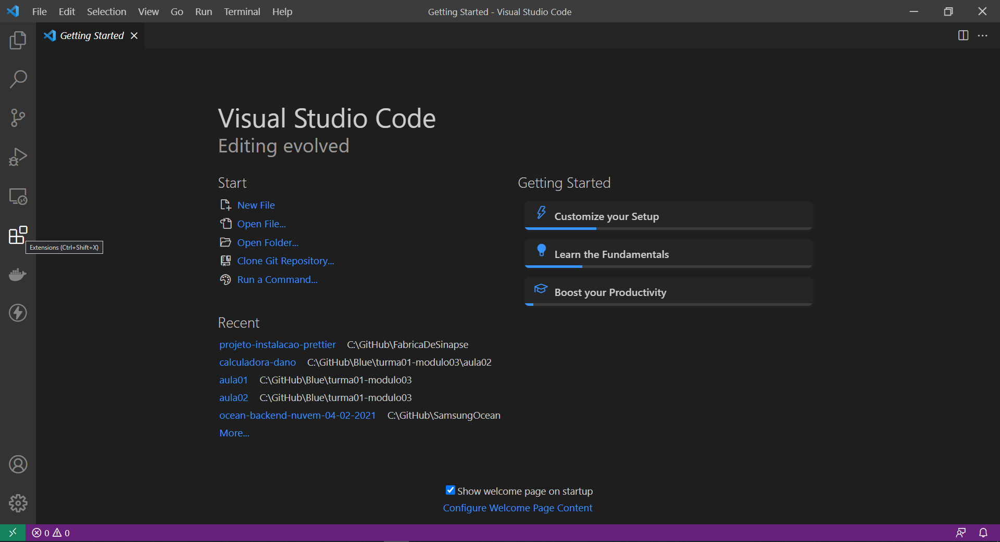

# Samsung Ocean - Trilha Backend: Preparação

Para participar os cursos da trilha de backend do Samsung Ocean você precisa instalar o software NodeJS e o editor de códigos Visual Studio Code.

## NodeJS

Acesse o site do NodeJS e faça o download da versão LTS mais atualizada e que corresponda ao seu sistema operacional.

https://nodejs.org/en/download/

Faça a instalação do software seguindo as opções padrão.

Caso você esteja no Windows, o software `npm` (node package manager) também será instalado.

Caso você esteja no Linux, pode ser necessário instalar o `npm` separadamente.

## Visual Studio Code

Faça o download do VSCode em https://code.visualstudio.com/download.

Após instalar, abra o software e procure pelo botão `Extensions` no menu esquerdo.

Procure e instale as seguinte extensões:

- Prettier - Code formatted (Extension ID: esbenp.prettier-vscode)
- Thunder Client (Extension ID: rangav.vscode-thunder-client)

## Conclusão

Pronto! Agora o NodeJS, NPM e Visual Studio Code estão devidamente instalados e configurados.

Se quiser se adiantar um pouquinho e começar a brincar com o NodeJS para testar se está tudo funcionando corretamente, procure por algum tutorial na internet mostrando como fazer o primeiro `hello world`, existem diversos conteúdos gratuitos que podem te ajudar a matar a vontade de aprender a desenvolver APIs enquanto o curso não chega.

É importante ter em mente que para a realização dos cursos do Ocean **não é necessário ter conhecimento prévio**, a menos que seja um curso muito específico que deixa isso bem claro nos **pré-requisitos**.