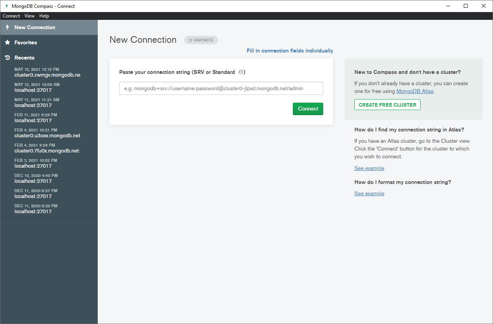
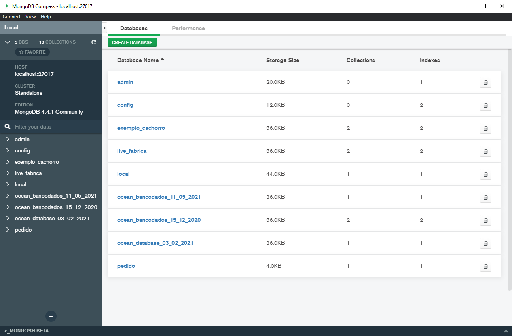

# Samsung Ocean - Trilha Backend: Preparação

Para participar os cursos da trilha de backend do Samsung Ocean você precisa instalar o software NodeJS e o editor de códigos Visual Studio Code.

Caso você também vá participar do curso `Laboratório de Backend e Banco de Dados com MongoDB`, é necessário também instalar o MongoDB.

## NodeJS

Acesse o site do NodeJS e faça o download da versão LTS mais atualizada e que corresponda ao seu sistema operacional.

https://nodejs.org/en/download/

Faça a instalação do software seguindo as opções padrão.

Caso você esteja no Windows, o software `npm` (node package manager) também será instalado.

Caso você esteja no Linux, pode ser necessário instalar o `npm` separadamente.

## Visual Studio Code

Faça o download do VSCode em https://code.visualstudio.com/download.

Após instalar, abra o software e procure pelo botão `Extensions` no menu esquerdo.

Procure e instale as seguinte extensões:

- Prettier - Code formatted (Extension ID: esbenp.prettier-vscode)
- Thunder Client (Extension ID: rangav.vscode-thunder-client)

# MongoDB + MongoDB Compass (opcional)

Caso você também vá participar do curso `Laboratório de Backend e Banco de Dados com MongoDB`, é necessário também instalar o MongoDB.

Acesse o site do MongoDB e faça o download do `MongoDB Community Server` na versão mais atualizada e que corresponda ao seu sistema operacional.

**Atenção:** Se estiver usando o Windows 7, instale a versão `4.2.14`, uma vez que a partir da versão 4.4.6 não há mais suporte para essa versão do Windows.

Certifique-se também de que o MongoDB Compass será instalado, uma vez que as opções padrão de instalação já garantem isso. Caso esteja no Linux, pode ser necessário instalá-lo manualmente.

https://www.mongodb.com/try/download/community

O processo de instalação é bem demorado, mas não costuma ter maiores complicações. Assim que terminar, pode ser necessário reiniciar o computador para garantir que tudo está funcionando.

Para confirmar se o MongoDB está funcionando, abra o MongoDB Compass e, após a inicialização, clique no botão verde `Connect` na tela de `New connection`. Note que a caixa de texto ficará sem nada escrito, exibindo apenas um texto de `placeholder` que começa com `e.g.`.

Com isso, a tela de `Databases` deve aparecer.

## Conclusão

Pronto! Agora o NodeJS, NPM, Visual Studio Code e MongoDB estão devidamente instalados e configurados.

Se quiser se adiantar um pouquinho e começar a brincar com o NodeJS para testar se está tudo funcionando corretamente, procure por algum tutorial na internet mostrando como fazer o primeiro `hello world`, existem diversos conteúdos gratuitos que podem te ajudar a matar a vontade de aprender a desenvolver APIs enquanto o curso não chega.

É importante ter em mente que para a realização dos cursos do Ocean **não é necessário ter conhecimento prévio**, a menos que seja um curso muito específico que deixa isso bem claro nos **pré-requisitos**.
