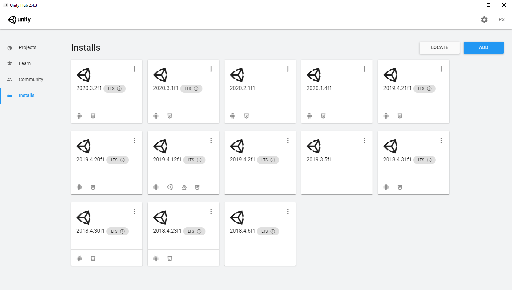

# Samsung Ocean - Trilha Games: Preparação

Para participar os cursos da trilha de games do Samsung Ocean você precisa instalar o software Unity Hub, escolher uma versão da Unity e o editor de códigos Visual Studio Code.

## Unity Hub

Acesse o site da Unity e faça o download do Unity Hub.

https://unity3d.com/pt/get-unity/download

Faça a instalação do software seguindo as opções padrão.

## Unity

Se essa é a primeira vez que você está usando a Unity, faça o login no Unity Hub e ative a licença de uso.

Não se preocupe, a Unity é gratuita para a maioria das pessoas, com exceção das empresas que faturaram mais do que $100.000 dólares nos últimos 12 anos.

Com o login feito e licença ativada, procure pela opção `Installs`, localizada no meu esquerdo do Unity Hub.

Agora, clique no botão `Add` e selecione uma versão da Unity, geralmente a versão mais recente que esteja marcada com `LTS`.

Após selecionar a versão, clique em  `Next`.

Na tela de instalação de módulos, não existe opções obrigatórias e é possível instalar qualquer opção conforme a necessidade. No entanto, caso queira produzir jogos para as plataformas Android ou para a Web, selecione `Android Build Support` e `WebGL Build Support`.

**Não** é necessário marcar a opção `Microsoft Visual Studio Community 2019`, pois iremos utilizar o `Visual Studio Code`.

Clique na opção `Done` e aguarde o processo finalizar.

## Visual Studio Code

Faça o download do VSCode em https://code.visualstudio.com/download.

Após instalar, abra o software e procure pelo botão `Extensions` no menu esquerdo.

Procure e instale as seguinte extensões:

- C# (Extension ID: ms-dotnettools.csharp)
- Unity Tools (Extension ID: tobiah.unity-tools)
- Unity Code Snippets (Extension ID: kleber-swf.unity-code-snippets)

Depois, baixe e instale o Microsoft .NET Framework 4.7.1 no link https://www.microsoft.com/en-us/download/details.aspx?id=56119

Em alguns casos, é necessário reiniciar o computador para que tudo esteja funcionando corretamente.

## Conclusão

Pronto! Agora a Unity e o VSCode estão devidamente instalados e configurados.

Se quiser se adiantar um pouquinho e começar a brincar com a Unity para testar se está tudo funcionando corretamente, procure por algum tutorial na internet mostrando como fazer o primeiro jogo, existem diversos conteúdos gratuitos que podem te ajudar a matar a vontade de aprender a desenvolver jogos enquanto o curso não chega.

É importante ter em mente que para a realização dos cursos do Ocean **não é necessário ter conhecimento prévio**, a menos que seja um curso muito específico que deixa isso bem claro nos **pré-requisitos**.